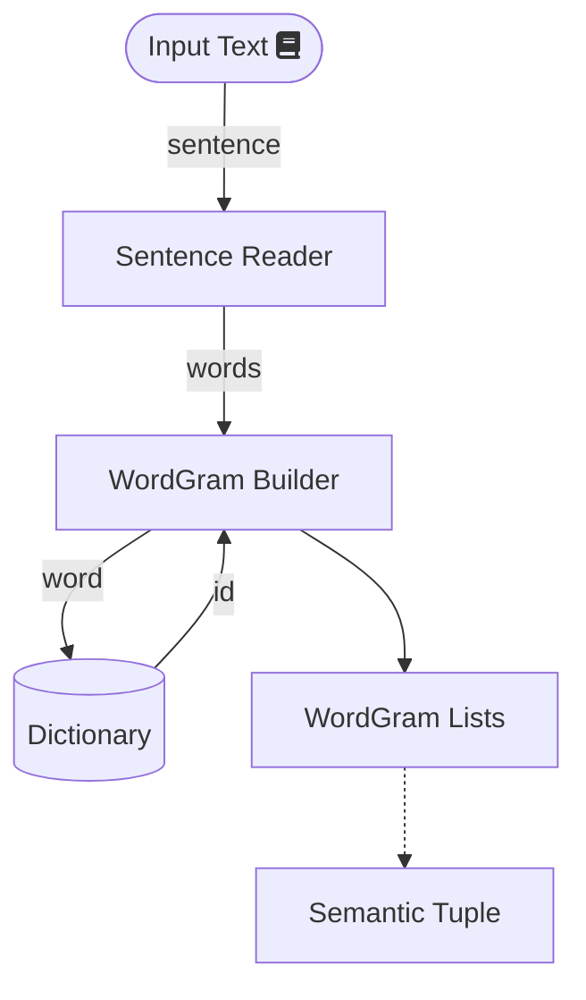

# System Overview

## Architecture

```mermaid
flowchart TD
    Input([Input Text fa:fa-book])
    SentenceReader[Sentence Reader]
    WordGramBuilder[WordGram Builder]
    Dictionary[(Dictionary)]
    SemanticTuple[Semantic Tuple]
    WordGramLists[WordGram Lists]
    Input -- sentence --> SentenceReader
    SentenceReader -- words --> WordGramBuilder
    WordGramBuilder -- word --> Dictionary
    Dictionary -- id --> WordGramBuilder
    WordGramBuilder --> WordGramLists
    WordGramLists -.-> SemanticTuple
```

## Components
- [Anticipatory Story Reader](/overview/asr)
- Long-term memory
- Short-term working memory
